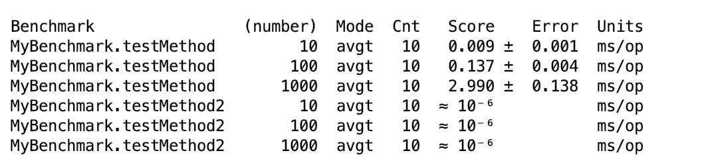
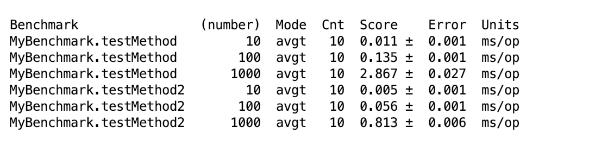

## TP2 - JMH et les micro-benchmarks

PENG Hanyuan & YAN Wenli

---

### 1. Etude de JMH

JMH est un Micro Benchmark Framework. C’est-à-dire: c’est au niveau de méthode. La précision peut être à quelques microsecondes. On peut voir que JMH est principalement utilisé lorsque nous avons trouvé la fonction de point d'accès et que nous devons optimiser davantage la fonction de point d'accès, nous pouvons utiliser JMH pour analyser quantitativement l'effet de l'optimisation.

**D'autres cas d'utilisation plus typiques sont:**

- Nous voulons savoir quantitativement combien de temps une fonction doit être exécutée et la corrélation entre le temps d'exécution et l'entrée n.

- Lorsque'une fontion a deux implémentations différentes (par exemple, l'implémentation A utilise `FixedThreadPool` et l'implémentation B utilise `ForkJoinPool`). Nous voudrons savoir quelle implémentation fonctionne est le mieux.

#### 1.1 Notions basiques du JMH

##### Mode
*Mode* indique le mode utilisé par JMH pour Benchmark. Habituellement, les dimensions des mesures sont différentes ou la manière dont elles sont mesurées est différente. Il existe actuellement quatre modes dans JMH:

- **Throughput:** débit global, tel que "le nombre d'appels pouvant être exécutés en 1 seconde".
- **AverageTime:** durée moyenne de l'appel, telle que "Durée moyenne (millisecondes) par appel".
- **SampleTime:** échantillonnage aléatoire, et sortie finalement la distribution des résultats d'échantillonnage, par exemple, "99% des appels se situent à moins de xxx millisecondes et 99,99% des appels se situent à moins de xxx millisecondes"
- **SingleShotTime:** tous les modes ci-dessus sont définis par défaut( L'itération est 1) , seul SingleShotTime n'est exécuté qu'une fois. Le nombre d'échauffements ( warmup ) est souvent défini sur 0 en même temps pour tester les performances lors du démarrage à froid.

##### Iteration

##### Warmup

##### Fork

#### 1.2 Des annotations

##### `@Param`


### 2. Mise en place d’un micro-benchmark

#### 2.1 Algorithme
Nous avons fait deux versions de l'algorithme pour calculer le factoriel.

- ##### Version itérative

```java
public static int fac_for(int n) {
  int result = 1;
  for (int i = 1; i <= n; i++) {
    result = result * i;
  }
  return result;
}
```

- ##### Version récursive

```java
public static int fac(int n) {
  if (n == 1) {
    return 1;
  } else {
    return fac(n - 1) * n;
  }
}
```

### 3. Unit Test
Nous avons utilisé `JUnit` pour faire le test unitaire.

```java
public class AlgoTest {
    int[] param = {2, 4, 8, 10};
    int[] result = {2, 24, 40320, 3628800};
    @Test
    void testFor() {
        for (int i = 0; i < 4; i++) {
            assertEquals(result[i], Algo.fac_for(param[i]),"Iteration version Error");
        }
    }
    @Test
    void testRe() {
        for (int i = 0; i < 4; i++) {
            assertEquals(result[i], Algo.fac(param[i]), "Recursive Version Error");
        }
    }
}

```

###### Résultat:


### 4. Résultat du benchmark
***La méthode `testMethod` est fait pour la version récursive et la méthode `testMethod2` est fait pour la version itérative.***

Code:

```java
@State(Scope.Benchmark)
@BenchmarkMode(Mode.AverageTime)
@OutputTimeUnit(TimeUnit.MILLISECONDS)
@Warmup(iterations = 2, time = 1, timeUnit = TimeUnit.MILLISECONDS)
@Measurement(iterations = 5, time = 1)
@Fork(value = 2)
public class MyBenchmark {

    @Param({"10", "100", "1000"})
    private int number;

    @Benchmark
    public void testMethod(Blackhole blackhole) {
        for (int i = 0; i < 1000; i++) {
            int result = Algo.fac(number);
            blackhole.consume(result);
        }

    }

    @Benchmark
    public void testMethod2(Blackhole blackhole) {
        for (int i = 0; i < 1000; i++) {
            int result = Algo.fac_for(number);
            blackhole.consume(result);
        }
    }

}
```
#### Mode.AverageTime


### 5. Erreurs & Solutions

#### Consommation du résultat
Nous n'avons pas "consumé" le résultat de notre algorithme dans notre première version de benchmark.

Le temps d'exécution de la version itérative est très petit car les codes de la version itérative est le "Dead Code" pour le JVM.

Mais pour la version récursive, comme la méthode va utiliser le résultat de `f(n-1)` il y a pas beaucoup d'influence même si nous n'avons pas consumé le résultat à la fin.

Nous avons utilisé la méthode `consume` de la classe `org.openjdk.jmh.infra.Blackhole` pour consumer le résultat.

###### Non consommation de résultat


###### Avoir la consommation de résultat

