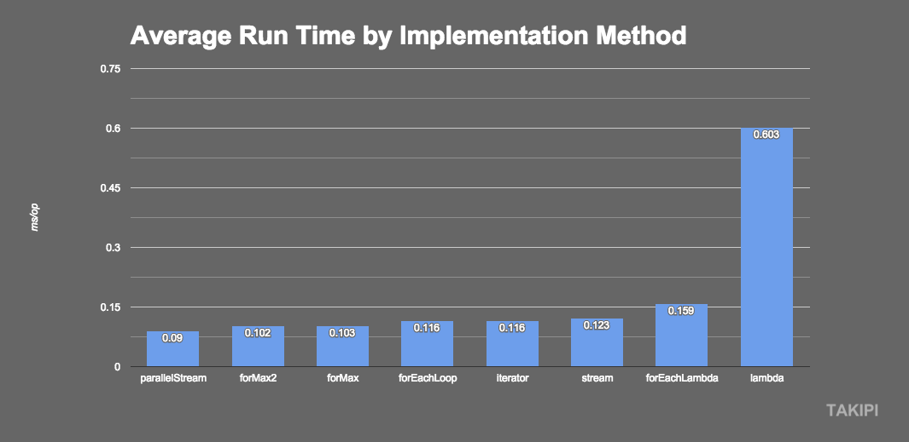

## TP3 - Lambda & Stream

PENG Hanyuan & YAN Wenli

---

### 1. Lambda
#### 1.1 Qu'est-ce que c'est?

Les expressions Lambda sont une nouvelle fonctionnalité importante incluse dans Java SE 8. Elles fournissent un moyen clair et concis de représenter une interface de méthode à l'aide d'une expression. Les expressions Lambda améliorent également les bibliothèques de la collection, facilitant ainsi l’itération, le filtrage et l’extraction de données d’une collection.

#### 1.2 Comment ca marche


```java

(int a, int b) -> {  return a + b; };

(String s) -> { System.out.println(s); };

() -> 42;

x -> 2 * x;

() -> { return 3.1415 };

```
L'écriture d'une expression lambda doit respecter plusieurs règles générales :

- zéro, un ou plusieurs paramètres dont le type peut être déclaré explicitement ou inféré par le compilateur selon le contexte
- les paramètres sont entourés par des parenthèses et séparés par des virgules. Des parenthèses vides indiquent qu'il n'y a pas de paramètre
- lorsqu'il n'y a qu'un seul paramètre et que son type est inféré alors les parenthèses ne sont pas obligatoires
- le corps de l'expression peut contenir zéro, une ou plusieurs instructions. Si le corps ne contient d'une seule instruction, - les accolades ne sont pas obligatoires et le type de retour correspond à celui de l'instruction. Lorsqu'il y a plusieurs instructions alors elles doivent être entourées avec des accolades

##### Exemple
Une expression lambda ne peut être utilisée que dans un contexte où le compilateur peut identifier l'utilisation de son type cible (target type) qui doit être une interface fonctionnelle.

Dans Java SE 8, une interface qui possède qu'une seule méthode s'appelle une "interface fonctionnelle".

L'interface fonctionnelle avec la nouvelle syntaxe lambda:

```java
public class RunnableTest {
  public static void main(String[] args) {                
    System.out.println("=== RunnableTest ===");
    // Anonymous Runnable
    Runnable r1 = new Runnable(){
      @Override
      public void run(){
        System.out.println("Hello world one!");
      }
    };
    // Lambda Runnable
    Runnable r2 = () -> System.out.println("Hello world two!");
    // Run em!
    r1.run();
    r2.run();
  }
}
```

#### 1.3 Les impacts
Les expressions lambda ne sont pas complètement du “Syntactic Sugar”.
 - Le compilateur ne les traduit pas en quelque chose qui est déjà compris par JVM.

En fait, si Lambdas n'est utilisé que quelques fois, il y aura des pénalités de performance. La JVM génère une nouvelle classe pendant la compilation lorsque la Lambda est appelée pour la première fois. Après cela, cette classe peut être réutilisée. Utiliser un Lambda une fois coûte cher, en effet.


### 2. Stream

#### 2.1 Qu'est-ce que c'est?
API Stream est une nouvelle façon de gérer les Collections en Java 8.

Stream traite l'ensemble des éléments comme le flux transmis dans le pipeline. Les donnés pouvant être traitées sur les nœuds du pipeline tels que le filtrage, le tri et l'agrégation.

Le flux d'éléments est traité dans le pipeline par une opération intermédiaire et finalement le résultat du traitement est obtenu à partir de l'opération de terminal.

La collection d'éléments à traiter par ce style - Stream est considérée comme un flux qui est transmis dans un pipeline et peut être traité sur les nœuds du pipeline, tels que le filtrage, le tri, l'agrégation, etc. Le flux de l'élément est traité dans le pipeline par un fonctionnement intermédiaire (opération intermédiaire), et enfin le résultat du traitement est obtenu par l'opération finale (opération terminale).


```java
List<Integer> transactionsIds = widgets.stream()
             .filter(b -> b.getColor() == RED)
             .sorted((x,y) -> x.getWeight() - y.getWeight())
             .mapToInt(Widget::getWeight)
             .sum();
```

#### 2.2 Comment ca marche
En Java 8, on peut créer un stream de plusieurs façons. La plus simple consiste à appeler la méthode stream() ou parallelStream() sur une collection, mais un certain nombre de méthodes ont été ajoutées aux classes déjà existantes.

Stream () - Crée un Stream série pour la collection.
parallelStream () - Crée un Stream  parallèle pour la collection.

#### 2.3 Méthodes pricipales
Nom|Explication
-|-
collect(toList())|Générer une liste via Stream
map|Convertir une valeur dans un flux en une nouvelle valeur
filter|Filtrer les éléments dans le flux
flatMap|Connecter plusieurs flux dans un flux
max|Trouver la valeur maximale
min|Trouver la valeur minimale
reduce|Générer une nouvelle valeur à partir d'un ensemble de valeurs

#### 2.3 Un exemple - Calcul d’une liste
Pour mieux compredre, nous proposons un un exemple simple comme ci-dessous:
- La façon `for`
```java
List<Integer> list = Arrays.asList(1, 2, 3, 4, 5);
int sum = 0;
for (int i = 0; i < list.size(); i++) {
    sum += list.get(i);
}
System.out.println(sum);
```
- La façon `Stream`
```java
List<Integer> list = Arrays.asList(1, 2, 3, 4, 5);
int sum = list.stream().reduce(0, (acc, value) -> acc + value);
System.out.println(sum);
```

Avec Stream, le code est très propre, c’est clair à lire et à comprendre rapidement ce qu'on veut faire. Il obtient d’abord l’objet Stream par la méthode `stream ()`, puis appelle la méthode `reduce()` dans le Stream pour calculer, puis obtient le résultat.


#### 2.4 Propriétés spécifiques
- Un stream ne stocke pas de données(“Memery friendly”)
Contrairement à une collection. Il se contente de les transférer d’une source vers une suite d’opérations, mais il stocke pas de données.

- Un stream ne modifie pas les données de la source sur laquelle il est construit.
S’il doit modifier des données pour les réutiliser, il va construire un nouveau stream à partir du stream initial. Ce point est très important pour garder une cohérence lors de la parallélisation du traitement.

- Le chargement des données pour des opérations sur un stream s’effectue de façon lazy.
Cela permet d’optimiser les performances de nos applications. Par exemple, si l’on recherche dans un stream de chaînes de caractères, une chaîne correspondant à un certain pattern, cela nous permettra de ne charger que les éléments nécessaires pour trouver une chaîne qui conviendrait, et le reste des données n’aura alors pas à être chargé.

- Un stream peut ne pas être borné, contrairement aux collections.
Un stream peut ne pas être borné, contrairement aux collections. Il faudra cependant veiller à ce que nos opérations se terminent en un temps fini – par exemple avec des méthodes comme limit(n) ou findFirst( ).

- Un stream n’est pas réutilisable.
Une fois qu’il a été parcouru, si l’on veut réutiliser les données de la source sur laquelle il avait été construit, nous serons obligés de reconstruire un nouveau stream sur cette même source.


#### 2.5 Les impacts

Code efficace, propre et concis, augmenter considérablement la productivité;

Mais il faut faire attention, l'utilisation d'un stream n'améliore pas nécessairement les performances, mais peut aussi les dégrader.

Nous avons trouvé sur internet un article qui montre que les impacts sur les performances.
Le benchmark:



##### Analyse de résultats
Pourquoi le `for loop` est plus vite que `Stream` dans ce Benchmark?
Les compilateurs ont plus de 40 ans d’expérience dans l’optimisation des boucles et le compilateur JIT de la machine virtuelle est particulièrement apte à optimiser les boucles sur des tableaux. En revanche, le stream est un ajout très récent à Java 8 et le compilateur JIT n’effectue pas (encore) d’optimisations particulièrement sophistiquées.

Mais ce n'est pas une situation typique. Les chiffres de performance changent considérablement si la fonctionnalité appliquée à chaque élément de la séquence nécessite beaucoup de ressources processeur. Vous constaterez qu'il n'y a plus de différence mesurable entre le for-loop et le stream séquentiel si la fonctionnalité est fortement liée à CPU.

##### Petite conclusion
Le stream n'est pas toujours plus lent que les boucles, il peut être aussi rapide. cela dépend des circonstances.

Le principal avantage d'utiliser Stream est “memory friendly” - qui ne stocke pas de données.


#### Références
1. How Java 8 lambdas and streams perform compared to longstanding implementations?
https://blog.takipi.com/benchmark-how-java-8-lambdas-and-streams-can-make-your-code-5-times-slower/

2. What Lambda Expressions are compiled to? What is their runtime behavior?
https://www.logicbig.com/tutorials/core-java-tutorial/java-8-enhancements/java-lambda-functional-aspect.html

3. Les expressions lambda
https://www.jmdoudoux.fr/java/dej/chap-lambdas.htm

4. Java SE 8: Lambda Quick Start
https://www.oracle.com/webfolder/technetwork/tutorials/obe/java/Lambda-QuickStart/index.html

5. Java performance tutorial – How fast are the Java 8 streams?
https://jaxenter.com/java-performance-tutorial-how-fast-are-the-java-8-streams-118830.html

6. JDK 8: Lambda Performance study
https://www.oracle.com/technetwork/java/jvmls2013kuksen-2014088.pdf
7. Performance With Java8 Streams
https://dzone.com/articles/performance-with-java8-streams

8. What About the Performance of Java 8 Lambdas?
https://www.beyondjava.net/performance-java-8-lambdas
