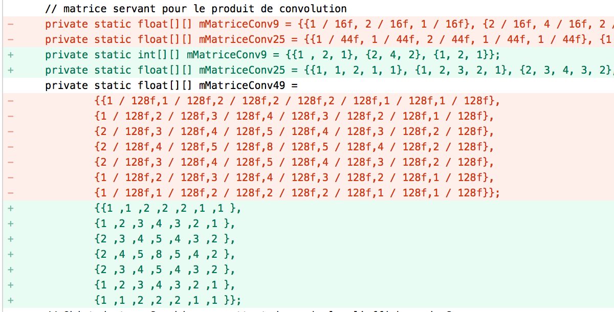
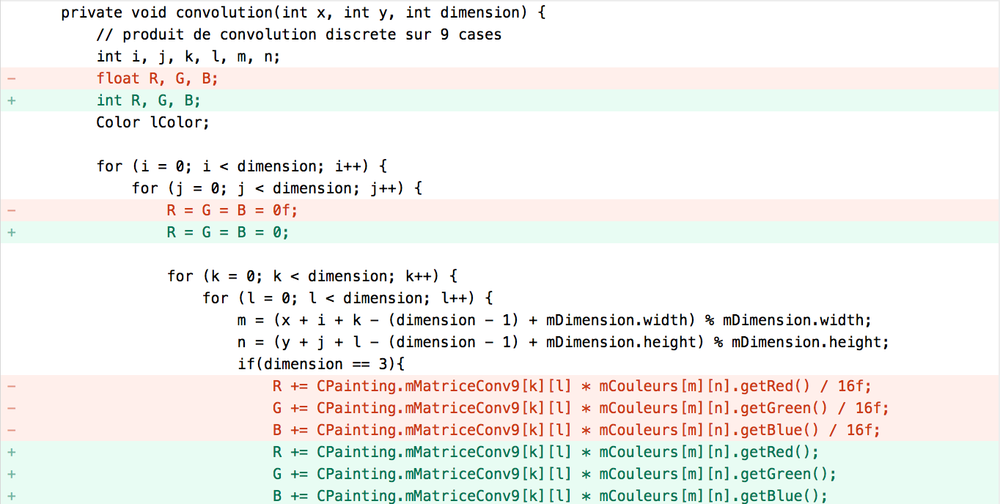
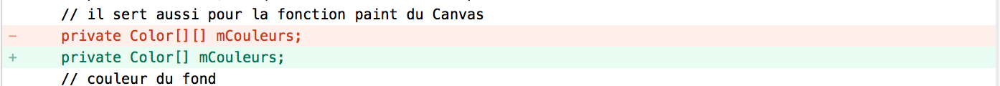
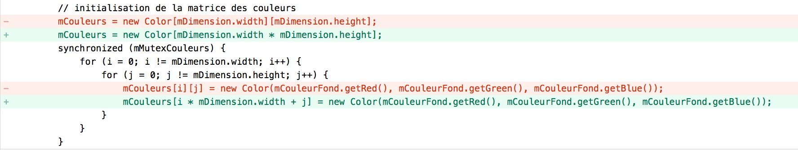
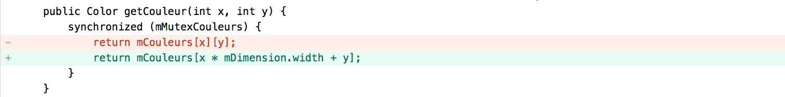
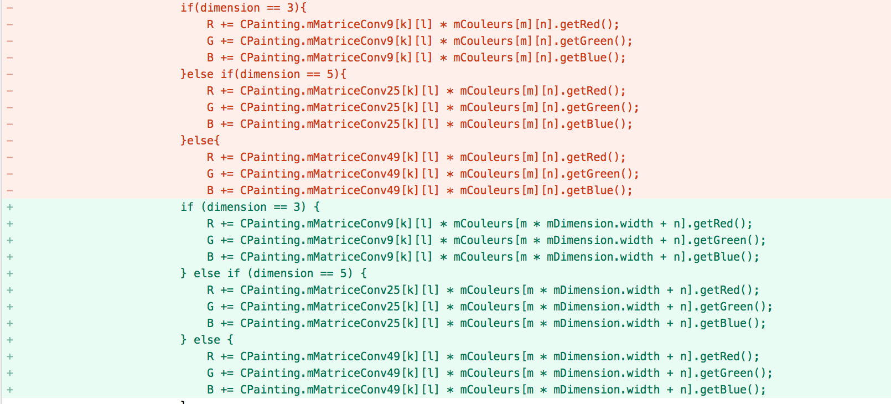

## TP5 Optimisation paintingants

PENG Hanyuan & YAN Wenli

---
Nous avous crée différentes branches pour des changements.

D'abord, on utilise des outils comme Jvisualvm pour visualier des performances sur ce sujet. On peut trouver qu'il prend beaucoup de temps (CPU) pour le calcul de convolution, et la fonction `setColor`. En même temps, la class `Color` est beaucoup applée cependant.


#### 1.Moins de Boxing et Unboxing
Pour éviter le Boxing et Unboxing, nous avons utilisé que des types originaux comme `int` dans ce sujet.

##### Impact sur la performance


#### 2.Moins de répétabilité
Afin d'éviter des opérations répétées, on a mis la devision à la fin.
Avant:

Après:
```java
private static int[][] mMatriceConv49 =
              {{1, 1, 2, 2, 2, 1, 1},
                {1, 2, 3, 4, 3, 2, 1},
                {2, 3, 4, 5, 4, 3, 2},
                {2, 4, 5, 8, 5, 4, 2},
                {2, 3, 4, 5, 4, 3, 2},
                {1, 2, 3, 4, 3, 2, 1},
                {1, 1, 2, 2, 2, 1, 1}};
```

```java
        R = R / 16;
        G = G / 16;
        B = B / 16;
```




##### Impact sur la performance


#### 3.Changement de type de données : float - int
Après des études sur le projet, on pense qu'il n'a pas besoin d'utiliser le type `float` pour la plus part de temps, `int` est suffit, donc on modifie le type où il utilisait `float`.



##### Impact sur la performance


#### 4.mCouleur 2D en 1D






...

##### Impact sur la performance
