## TP5 Optimisation paintingants

PENG Hanyuan & YAN Wenli

---
Nous avous crée différentes branches pour des changements.

D'abord, on utilise des outils comme Jvisualvm pour visualier des performances sur ce sujet. Dans le moniteur, nous avons choisi des performance sur la mémoire en une minute pour assurer que nous comparons sous les mêmes facteurs.

On peut trouver qu'il prend beaucoup de temps (CPU) pour le calcul de convolution, et la fonction `setColor`. En même temps, la class `Color` est beaucoup applée cependant.

#### 0. Statut original
- FPS original


- CPU original

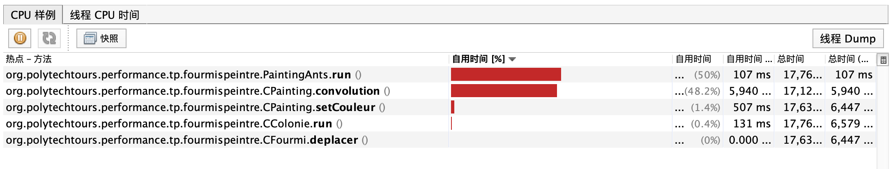

- Memery original

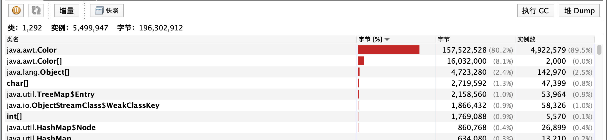

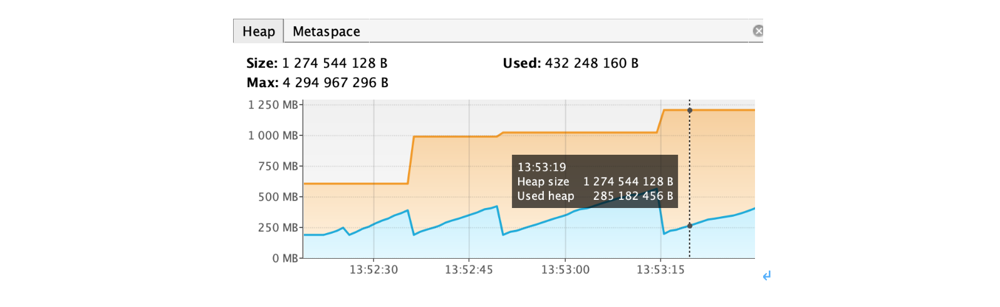


#### 1.Moins de Boxing et Unboxing
Pour éviter le Boxing et Unboxing, nous avons utilisé que des types originaux comme `int` dans ce sujet.


#### 2. Matrice de convolution en static
Les matrice de convolution sont initialisées dans le constructeur de la classe `CPainting` dans la version originale. Nous pensons que nous pouvons mettre ces matrices en static pour qu'elles initialise pendant la charge de classe.

```java
private static int[][] mMatriceConv9 = ...;
private static int[][] mMatriceConv25 = ...;
private static int[][] mMatriceConv49 = ...;
```


#### 3.Changement de type de données : float - int
Après des études sur le projet, on pense qu'il n'a pas besoin d'utiliser le type `float` pour la plus part de temps, `int` est suffit, donc on modifie le type où il utilisait `float`.


#### 4.mCouleur 2D en 1D
Nous avons changé la structure de données de `mCouleur` d'un tableau à deux dimensions à un tableau à une dimension.

Comparaison:
- Lors de parcourer toutes les données d'un tableau, un tableau 2D a besoin plus de boucles `for`.

- Lors de l'allocation de mémoire, le code de tableau unidimensionnel est plus concis et le tableau multidimensionnel doit être attribué pas à pas à l'aide de boucles. Le tableau multidimensionnel a besoin de plus de mémoire pour stocker les pointeurs qui pointent sur la deuxième dimension.

- Les tableaux unidimensionnels sont plus pratiques pour lire et écrire des données dans un fichier.


...

##### Impact sur la performance
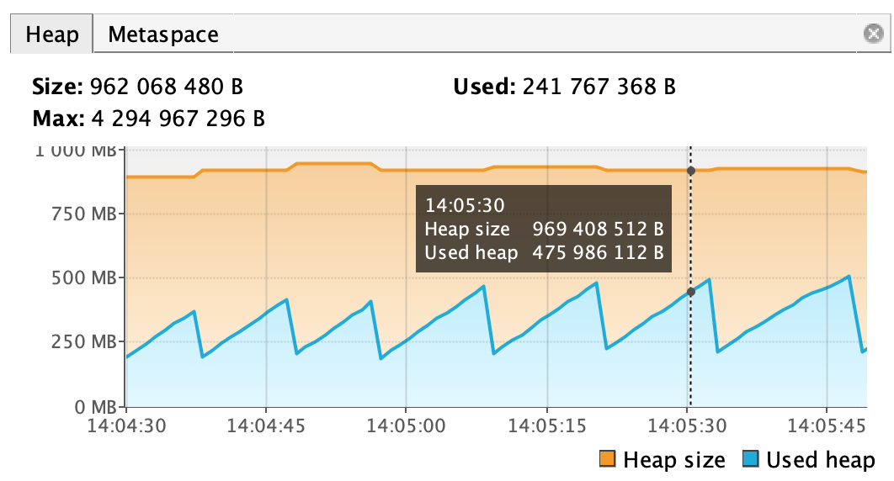
La mémoire requise pour cette méthode est plus petite et donc les performances de la mémoire légèrement optimisées.

#### 5.BufferStrategy
Nous avons essayé de utiliser le BufferStrategy dans la classe `CPainting` pour améliorer la performace (La branche bufferStrategy).

Après modifier le code, le programme exécute plus rapide.
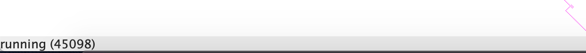

Mais le résultat n'est pas correct (notamment la diffusion) et nous n'avons pas fixer le bug.

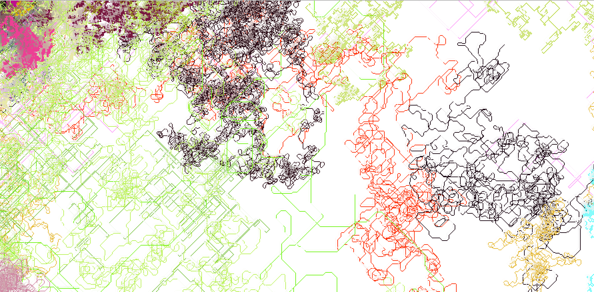

Pour le nombre de buffer, nous avons essayé de utiliser plus de buffer (2 par exemple). Mais il exécute moins rapide si le nombre de buffer est plus que 1.


```java
bs = getBufferStrategy();
if(bs == null) { //True if our canvas has no buffer strategy (should only happen once when we first start the game)
  createBufferStrategy(1); //Create a buffer strategy using two buffers (double buffer the canvas)
  return ;
}
```

##### Impact en performace
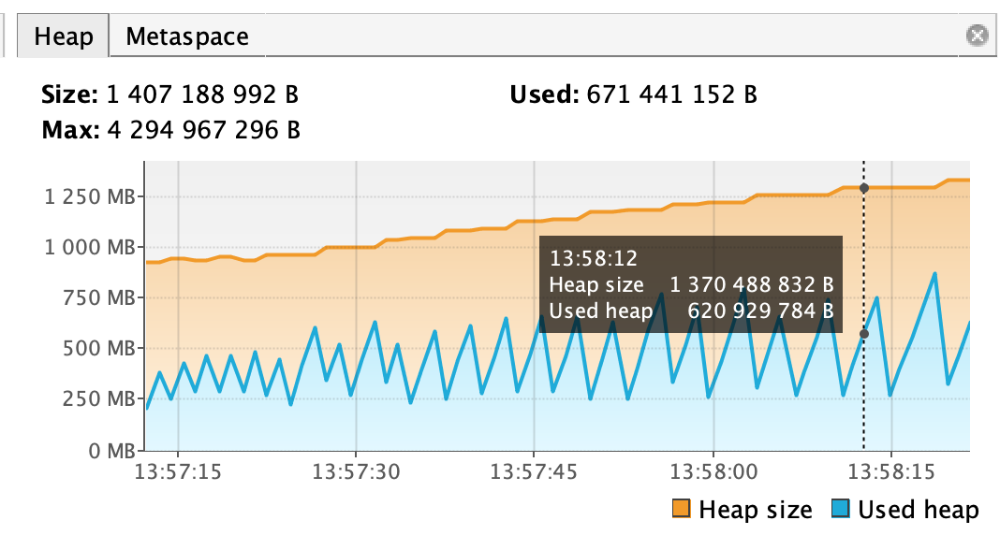
Selon cette image on peut trouver que la quantité totale de mémoire utilisée est similaire à celle d'origine. Bufferstrategy n'a pas d'optimisation sur la mémoire, mais le garbage collector est appelé plus fréquemment.

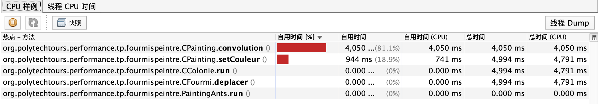
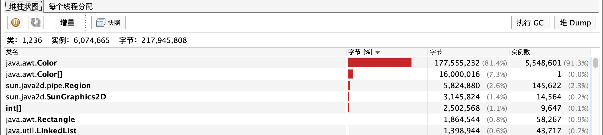

#### 6.BufferedImage & Raster

Après l'essaie de `BufferStrategy`, nous avons trouvé une autre classe `BufferedImage`.

La classe `BufferedImage` décrit une image avec un tampon accessible de données d'image. BufferedImage est composé d'un `Raster`.

Nous pouvons utiliser l'objet `WritableRaster` d'une `BufferedImage` pour manipuler l'image. Donc nous n'avons plus besoin de l'objet `Color` pour stocker l'information de couleur d'un pixel. À la place de `Color`, nous utilisons directement un tableau de `int` pour représenter couleur `RGB`.

Nous pouvons aussi diminuer la charge de l'affichage. Comme nous pouvons stocker l'information de pixel dans le `Raster`, nous pouvons afficher l'image après la fin de convolution pour chaque déplacement. Nous pouvons aussi faire afficher après un délais donné (affiche l'image chaque 10 déplacements par exemple).

##### Impact sur la performance

Après l'utilisation de BufferedImage et Raster, le programme exécute plus rapide et le résultat est bon.


Jvisualvm
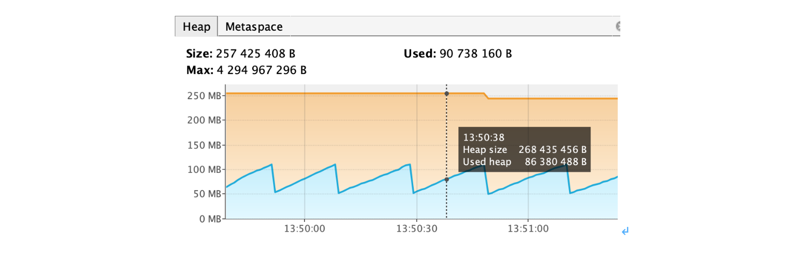
Avec Raster, la performance sur mémoire est grandement améliorée. Avant, Heap size est 1250M, maintenant est juste 250M. Et c'est pareil en Used Heap.

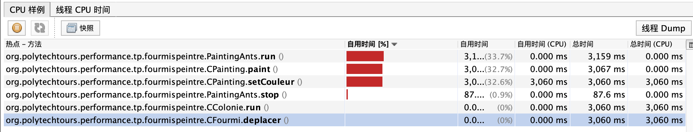
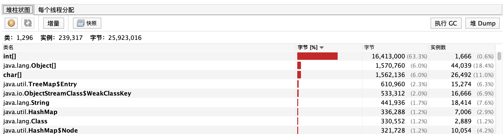

Nous pouvons trouver que la méthode `convolution` n'utilise pas beaucoup le CPU après la modification, parce que avec le `BufferedImage`, nous stockons les résultats de convolution dans le `Raster` et nous dessinons l'image une seule fois pour chaque déplacement. Par contre, dans la version originale, il dessine sur l'image après le calcul de chaque pixel.

Avec `BufferedImage`, nous n'utilisons plus la classe `Color` pour représenter le couleur de chaque pixel. Nous utilisons un tableau `int` de dimension 3 pour les couleurs. Donc le GC se lance moins fréquent et le programme utilise moins de mémoire.
